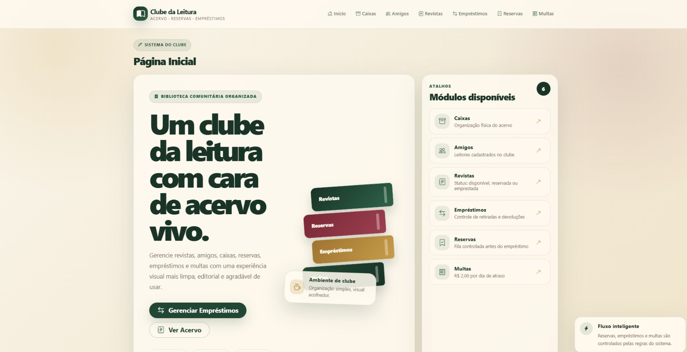

#   📚 CLUBE DA LEITURA    |   Sistema de Gestão de Livros 🚀
> **Controle inteligente de revistas, caixas e empréstimos para colecionadores.**

   

---

# 📌 Sobre o Projeto

O **Clube da Leitura** foi desenvolvido para  gerenciar o empréstimo de sua coleção de revistas em quadrinhos para amigos de forma organizada e eficiente.

---
### 📦 Módulo de Caixas
> **Ações Suportadas:** `Cadastrar` | `Editar` | `Excluir` | `Visualizar`

| Parâmetro | Regra de Negócio |
| :--- | :--- |
| **Etiqueta** | Obrigatória, única e com limite máximo de 50 caracteres. |
| **Configuração** | Definição de Cor Hex e tempo de empréstimo (padrão de 7 dias). |
| **Segurança** | Bloqueio automático de exclusão se houver HQs vinculadas. |

---

### 📖 Módulo de Revistas
> **Ações Suportadas:** `Cadastrar` | `Editar` | `Excluir` | `Visualizar`

| Parâmetro | Regra de Negócio |
| :--- | :--- |
| **Validação** | Combinação de Título (2-100 caracteres) + Edição deve ser única. |
| **Vínculo** | Associação obrigatória a uma caixa organizadora cadastrada. |
| **Status** | Controle dinâmico: `Disponível` \| `Emprestada` \| `Reservada`. |

---

### 👥 Módulo de Amigos
> **Ações Suportadas:** `Inserir` | `Editar` | `Excluir` | `Visualizar`

| Parâmetro | Regra de Negócio |
| :--- | :--- |
| **Identificação** | Nome do amigo e do responsável (3-100 caracteres). |
| **Contato** | Telefone validado estritamente com 10 ou 11 dígitos. |
| **Restrição** | Impede nomes idênticos e bloqueia exclusão com empréstimos ativos. |

---

### 🤝 Módulo de Empréstimos
> **Ações Suportadas:** `Registrar Empréstimo` | `Registrar Devolução` | `Monitorar Atrasos`

| Parâmetro | Regra de Negócio |
| :--- | :--- |
| **Limite** | Permitido estritamente apenas 1 empréstimo ativo por amigo. |
| **Prazo** | Tempo de devolução calculado automaticamente baseado na caixa. |
| **Alertas** | Sistema de notificação e destaque visual para status `Atrasado`. |

# 🧠 Conceitos Aplicados

| Conceito | Aplicação |
|---|---|
| 🏗️ POO | Modelagem das entidades físicas do clube |
| 📐 Camadas | Separação estrita de responsabilidades |
| ⚙️ Regras | Validação robusta contra duplicidade e perdas |

## 👨‍💻 Autores

Desenvolvido por **Pedro Henrique** e **Marco Oliveira**.

